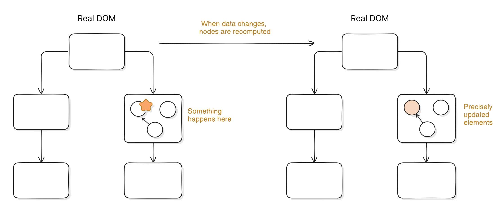
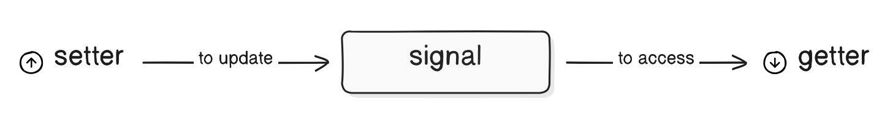

# 响应式编程的重要性

响应式编程（Reactivity）能够**保持用户界面（UI）与状态的同步**，从而减少手动更新的需求。通过自动追踪数据变化并触发视图更新，开发者无需编写冗余的DOM操作代码，显著提升开发效率并降低错误率

**实时更新**（Real-time updates）进一步增强了用户体验，使应用能够即时响应用户操作或后端数据变化。例如，在聊天应用或股票行情系统中，用户无需刷新页面即可看到最新消息或价格变动，从而创造更流畅、自然的交互体验

这种机制不仅简化了开发流程，还通过优化渲染性能（如虚拟DOM差分更新）确保了高频数据场景下的流畅性。

```tsx
function Counter() {
  const [count, setCount] = createSignal(0);
  const increment = () => setCount((prev) => prev + 1);

  return (
    <div>
      <span>Count: {count()}</span>{" "}
      {/* Only `count()` is updated when the button is clicked. */}
      <button type="button" onClick={increment}>
        Increment
      </button>
    </div>
  );
}
```

此计数器功能会设置一个按钮，当点击该按钮时，会调用递增函数将计数器值增加 1。这样只会更新显示的数字，而不会刷新整个组件。



# 响应式原理

## Signals

Signals 是响应式系统中的核心元素，对数据管理及系统响应能力起着重要作用。它们负责存储和管理数据，并促使整个系统进行更新。这通过使用获取器（getter）和设置器（setter）来实现。

```tsx
const [count, setCount] = createSignal(0);
         |       |
     [getter] [setter]  
```



- **`getter`**：一种用于获取 signal 当前值的 **函数**。可以通过调用 getter  来访问组件内存储在 signal 中的数据。
- **`setter`**：用于修改 signal 值的函数。若要使整个应用程序中的响应式更新得以触发，您需调用 setter 来更新信号的值。

```tsx
console.log(count()); // 'count()' is a getter that returns the current value of 'count', which is '0'.

setCount(1); // the setter, 'setCount', updates the value of 'count'.

console.log(count()); // the updated value of 'count' is now '1'.
```

## Subscribers

Subscribers 是响应式系统中的另一个核心要素。他们负责监测信号的变化，并据此对系统进行更新。他们是自动响应式，能够使系统及时获取最新的数据变化。

订阅者的工作基于以下两个主要动作：

- **监听**：从根本上说，订阅者会监测信号。这使得订阅者能够随时察觉到他们所追踪的信号发生的任何变化。
- **响应**：当信号发生变化时，订阅者会收到通知。这会促使订阅者对 signal 的变化做出反应。这可能包括更新用户界面或调用外部函数等操作。

```tsx
function Counter() {
  const [count, setCount] = createSignal(0);
  const increment = () => setCount((prev) => prev + 1);

  createEffect(() => {
    console.log(count());
  });
  // the 'createEffect' will trigger the console log every time 'count' changes.
}
```

# 状态管理

状态管理是指对应用程序状态进行管理的过程。这包括存储和更新数据，以及对数据的变化做出响应。

在 Solid 中，状态管理是通过信号（Singal）和订阅者（Subscriber）来实现的。信号用于存储和更新数据，而订阅者则用于响应数据的变化。

## 跟踪变更

跟踪变更意味着要持续关注数据的任何变动，并据此做出相应处理。这可以通过使用订阅者的方式实现。

当一个信号未在跟踪范围内被访问时，对该信号的更新不会触发任何更新操作。这是因为如果一个信号未被跟踪，它无法向任何订阅者通知其变化情况。

```tsx
const [count, setCount] = createSignal(0);

console.log("Count:", count());

setCount(1);

// Output: Count: 0

// 'count' is not being tracked, so the console log will not update when 'count' changes.
```

由于初始化是一个一次性事件，如果在跟踪范围之外访问信号，该信号将不会被跟踪。要跟踪一个信号，必须在其订阅者的范围内进行访问。可以使用诸如 Effect 之类的响应式原语来创建订阅者。

```tsx
const [count, setCount] = createSignal(0);

createEffect(() => {
  console.log("Count:", count());
});

setCount(1);

// Output: Count: 0
//         Count: 1
```

## 更新视图

Solid 应用程序的用户界面是使用 JSX 构建的。JSX 在幕后创建了一个跟踪范围，这使得可以在组件的返回语句中跟踪信号。

```tsx
function Counter() {
  const [count, setCount] = createSignal(0);
  const increment = () => setCount((prev) => prev + 1);

  return (
    <div>
      <span>Count: {count()}</span>{" "}
      {/* ✅ will update when 'count()' changes. */}
      <button type="button" onClick={increment}>
        Increment
      </button>
    </div>
  );
}
```

组件与其他功能一样，只会运行一次。这意味着如果在返回语句之外访问信号，它会在初始化时运行，但对信号的任何更新都不会触发更新操作。

```tsx
function Counter() {
  const [count, setCount] = createSignal(0);
  const increment = () => setCount((prev) => prev + 1);

  console.log("Count:", count()); // ❌ not tracked - only runs once during initialization.

  createEffect(() => {
    console.log(count()); // ✅ will update whenever 'count()' changes.
  });

  return (
    <div>
      <span>Count: {count()}</span>{/* ✅ will update whenever 'count()' changes. */}
      <button type="button" onClick={increment}>
        Increment
      </button>
    </div>
  );
}
```

# 同步 vs. 异步

响应式系统旨在对数据的变化做出响应。这些响应可以是同步的，也可以是异步的，这取决于系统的性质。这取决于系统的性质。通常，这种选择取决于应用程序的需求以及所涉及任务的性质。

## 同步响应式

**同步响应式是 Solid 的 默认响应模式**，在这种模式下，系统会以直接且线性的方式对变化做出响应。当信号发生变化时，所有相应的订阅者都会按照顺序立即得到更新。

通过同步响应机制，系统能够以可预测的方式对变化做出响应。这在更新顺序至关重要的场景中非常有用。例如，如果一个订阅者依赖于另一个信号，那么确保该订阅者在依赖的信号更新之后才被更新就非常重要。

```tsx
const [count, setCount] = createSignal(0);
const [double, setDouble] = createSignal(0);

createEffect(() => {
  setDouble(count() * 2);
});
```

在该示例中，由于同步响应式的作用，double 在 count 完成后会始终得到更新。这确保了 double 始终与 count 的最新值保持一致。

## 异步响应式

当系统以延迟或非线性的方式响应变化时，称为异步响应式。信号（signal）变化时，对应的订阅者（subscriber）不会立即更新，而是等待特定事件或任务完成后才触发更新。

**核心价值的强依赖性**

- **多信号依赖的强一致性**

  当订阅者依赖多个信号时，异步响应式确保所有关联信号完成更新后，再统一通知订阅者。例如：若订阅者需要同时读取信号A和信号B，系统会等待两者均更新完毕，再触发订阅者逻辑，避免数据不一致

- **延迟更新的必要性**

  异步响应式需明确处理更新延迟。例如，通过批处理（batch）机制暂存中间状态，待所有相关信号就绪后，再统一提交更新，减少冗余计算和渲染。

**技术实现关键点**

- **事件驱动架构**：通过事件队列（Event Loop）调度更新任务，确保非阻塞执行。
- **状态快照**：异步过程中，系统需捕获信号变更的中间状态，供订阅者最终一致性消费。
- **错误隔离**：若某个信号更新失败，需隔离异常并保留其他信号的合法状态。

示例说明：

```tsx
// 伪代码：批处理更新示例
batch(() => {
  signal1.update(value1); // 信号1更新
  signal2.update(value2); // 信号2更新
}); // 仅在此处统一触发订阅者更新
```

**注意事项**：

异步响应式虽提升性能，但需额外处理以下问题：

1. **竞态条件**：依赖信号的更新顺序需通过事务（transaction）或锁机制保证。
2. **调试复杂度**：延迟更新可能导致堆栈信息丢失，需依赖日志或调试工具追踪。

# 核心概念

- 信号（Signals）是响应式系统的核心元素，负责存储和管理数据。
- 信号通过 getter 和 setter 实现可读可写特性。
- 订阅者（Subscribers）是自动响应器，追踪信号变化并据此更新系统。
- 信号与订阅者协同工作，确保系统始终与最新数据变化保持同步。
- 响应式系统基于数据驱动响应（data-driven reactivity）原则构建，其响应性由底层数据决定。
- 响应式系统可分为同步（synchronous）与异步（asynchronous）两种模式。

