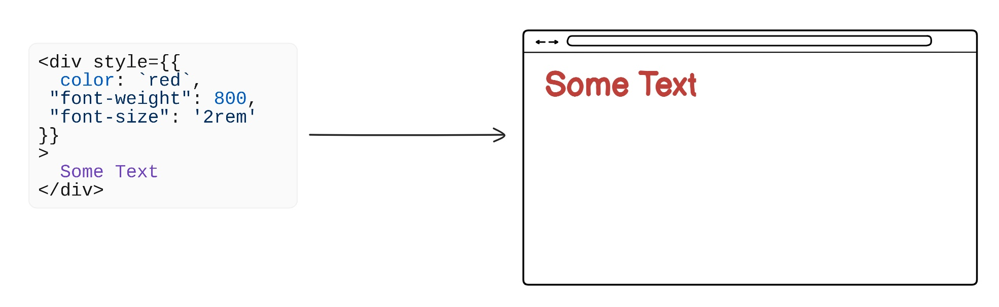

# 组件基础

组件是 Solid 应用的基本构建块。它们是可复用的单元，可以组合在一起构建更复杂的应用。

## 定义组件

```tsx
import type { JSX } from "solid-js";

export function Profile(props: { username: string; phone: string; children?: JSX.Element }) {
  console.log(props);
  return (
    <div>
      <div>{props.username}</div>
      <div>{props.phone}</div>
      <div>{props.children}</div>
    </div>
  );

```

> 注意：组件的名称必须以大写字母开头，以便和普通的 HTML 元素区分开。否则，它们将不会被识别为组件。

## 生命周期

组件有一个生命周期，用来定义它们如何被创建、更新和销毁。Solid 组件的生命周期与其他框架不同，因为它与响应式的概念紧密相关。

在一些框架中，每次状态变化时组件都会重新执行（如React），而 Solid 组件的生命周期与初次执行绑定。这意味着 Solid 组件只会在 **首次渲染到 DOM 时运行一次**。之后，即使应用状态发生变化，组件也不会被重新执行。

当 Solid 组件渲染时，它会建立一个响应式系统来监控状态变化。当状态变化发生时，组件只会更新相关部分，而不会重新运行整个组件。通过在每次状态变化时跳过完整组件生命周期，Solid 相比那些每次更新都重新运行函数的框架，行为更可预测。

由于组件逻辑不会被持续访问，因此在使用 Solid 时，正确设置响应式系统非常重要。

### 初始化与配置

当组件首次渲染到 DOM 时，组件函数会被执行。在这里，你需要设置组件的状态和副作用，包括创建信号（signals）、存储（stores）、副作用（effects）以及其他响应式元素。由于组件函数内的逻辑不会被持续访问，因此从一开始就正确配置组件非常重要。

每个组件实例都是独立的，也就是说，每个组件都有自己的状态和副作用。通过建立正确的依赖关系，可以确保组件被正确初始化，从而允许组件在不同的场景下复用而互不干扰。

```jsx
function MyComponent() {
  const [count, setCount] = createSignal(0);

  console.log(count());

  return (
    <div>
      <p>Count: {count()}</p>
      <button onClick={() => setCount((prev) => prev + 1)}>Increment</button>
    </div>
  );
}
```

当这个组件渲染到 DOM 时，函数体会被执行。这包括创建 count 信号以及执行 console.log(count())，这会将当前的 count 值输出到控制台。此外，组件的 JSX 会被返回，并渲染到 DOM 中。

组件渲染完成后，即使组件的状态发生变化，console.log 语句也不会再次执行。不过，由于组件的 JSX 是响应式的，每次点击按钮都会更新 DOM 中的 count 值。

本质上，Solid 将关注点分开了：

- **初始设置逻辑**：在组件渲染时执行一次。
- **响应式逻辑**：在组件状态变化时执行。

### 条件渲染

要根据状态或其他条件显示不同的内容，可以使用条件渲染。由于组件函数只会执行一次，条件语句必须放在返回语句内部。这样的设计保证了条件分支清晰，并且易于理解。

```jsx
function MyComponent() {
  const [count, setCount] = createSignal(0);
  return (
    <div>
      {count() > 5 ? (
        <div>Count limit reached</div>
      ) : (
        <>
          <p>Count: {count()}</p>
          <button onClick={() => setCount((prev) => prev + 1)}>
            Increment
          </button>
        </>
      )}
    </div>
  );
}
```

这个示例使用三元运算符根据 count 的值有条件地渲染不同的内容。当 count 大于 5 时，组件会显示 “Count limit reached”。否则，它会显示当前的计数值以及一个增加按钮。

> 提示：为了简化条件渲染，Solid 提供了内置的控制流组件，例如 Show，可以让条件渲染的写法更清晰易读。
>
> ```jsx
> function MyComponent() {
>   const [count, setCount] = createSignal(0)
> 
>   return (
>     <div>
>       <Show
>         when={count() > 5}
>         fallback={
>           <>
>             <p>Count: {count()}</p>
>             <button onClick={() => setCount((prev) => prev+1)}>Increment</button>
>           </>
>         }
>       >
>         <div>Count limit reached</div>
>       </Show>
>     </div>
>   )
> }
> ```

# 样式

和 HTML 类似，Solid 使用 class 和 style 属性通过 CSS（层叠样式表）来给元素添加样式。

- **class 属性**：通过 CSS 规则为一个或多个元素设置样式。
- **style 属性**：行内样式，用于单个元素的样式设置。

## 行内样式

style 属性允许你为单个元素设置样式，并在运行时动态定义 CSS 变量。使用时，可以传入字符串或对象。

```jsx
// String
<div style="color: red; font-size: 16px;">This is a red div</div>

// Object
<div style={{ color: "red", "font-size": "16px" }}>This is a red div</div>
```

当使用对象时，键表示 CSS 属性名，值表示 CSS 属性值。键必须使用短横线（dash-case）格式，值必须是字符串。



虽然行内样式在快速原型开发中很有用，但不建议在生产环境中使用。这是因为它们不可复用，且随着时间推移难以维护。

## 类名样式

class 属性允许你通过 CSS 规则为一个或多个元素添加样式。这种方式更加结构化，因为可以在多个元素之间复用样式。

类（class）在 CSS 文件中定义，然后在使用它们的组件文件中导入。你可以在组件文件顶部使用 import 语句导入这些文件。一旦导入，类的作用域就限定在该组件及其子组件中。

```jsx
import "./Card.css";

function Card() {
  // ...
}
```

1）**动态样式**

动态样式提供了一种根据状态或其他因素（例如用户输入）改变组件外观的方式。这对于创建能够适应不同场景的组件非常有用，而无需为同一个组件创建多个版本：

```jsx
const [theme, setTheme] = createSignal("light");

<div class={theme() === "light" ? "light-theme" : "dark-theme"}>
  This div's theme is determined dynamically!
</div>;
```

Props 是另一种改变样式的方式。通过向组件传递 props，可以根据组件的使用场景或接收到的数据动态调整样式：

```jsx
function ThemedButton(props) {
  return (
    <button class={props.theme}>
      {props.theme === "light" ? "Light Button" : "Dark Button"}
    </button>
  );
}
```

2）**classList**

当你想给一个元素应用多个类时，可以使用 classList 属性。使用时，可以传入字符串或对象，其中对象的键表示类名，值表示布尔表达式。当值为 true 时，该类会被应用；为 false 时，该类会被移除。

```jsx
const [current, setCurrent] = createSignal("foo");

<button
  classList={{ "selected" : current() === "foo" }}
  onClick={() => setCurrent("foo")}
>
  foo
</button>;
```

在处理多个条件类时，classList 通常比 class 更高效。因为 classList 只会有选择地切换需要更改的类，而 class 每次都会重新计算。对于单个条件类，使用 class 可能更简单，但随着条件类数量增加，classList 提供了更易读且声明式的写法。

> 提示：
>
> 虽然可以混用 class 和 classList，但可能会引入意外错误。如果两者都是响应式的，当 class 的值变化时，Solid 会重新设置整个 class 属性，这会覆盖 classList 设置的类。
>
> 为避免这种情况，class 属性应该设置为静态字符串或为空。或者，也可以将 class 设置为静态计算值（例如 class={baseClass()}），但必须放在任何 classList 属性之前。
>
> 另外，由于 classList 是伪属性，它无法在 props 展开（如 <div {...props} />）或 <Dynamic> 中使用。

# 事件处理

Solid 提供了两种给浏览器添加事件监听器的方式：

- `on:__`：在元素上添加事件监听器，也称为原生事件（native event）。
- `on__`：将在文档上添加事件监听器，然后分发到元素，这称为委托事件（delegated event）—— 合成事件。

委托事件通过共享单个处理器来节省资源并提升常用事件的性能，而原生事件则提供了对事件行为的更高控制力。

代码示例：

```jsx
// 委派事件（合成事件）
<button onClick={handleClick}>Click me</button>

// 原生事件
<div on:scroll={handleScroll}>... very long text ...</div>
```

绑定参数：

```jsx
const handler = (data, event) => {
  console.log("Data:", data, "Event:", event);
};

<button onClick={[handler, "Hello!"]}>Click Me</button>;
```

动态绑定：

```jsx
<div onClick={() => props.handleClick?.()} />
```

### 事件委托

Solid 并未将事件监听器附加到每个单独的元素上，而是通过 `on__` 形式采用合成事件委派方法。在该方法中，事件监听器被附加到文档元素上，并在事件冒泡上升时将其分发给相关的元素。

这一点其实就是 React 中的合成事件。

如果需要将事件监听器附加到 Solid 的事件委派所不支持的元素上，例如自定义元素中的自定义事件，则可以使用 `on:__`。

```jsx
<div on:customEvent={handleCustomEvent} />
```

> **提示**：[Solid 支持的委派事件列表 ↪ ](https://docs.solidjs.com/concepts/components/event-handlers#list-of-delegated-events)

# Props

Props 是将状态从父组件传递给子组件的一种方式。这些只读属性通过 JSX 中的属性传递给组件，并可以在组件内部通过 props 对象访问：

```tsx
function App() {
  // Passing a prop named "name" to the MyComponent component
  return (
    <div>
      <MyComponent name="Ryan Carniato" />
    </div>
  );
}
```

在子组件中访问 props，需要使用 props 对象：

```tsx
function MyComponent(props) {
  return <div>Hello {props.name}</div>;
}
```

## mergeProps

mergeProps 是 Solid 提供的一个工具函数，用于合并多个可能是响应式的对象。它的行为类似于 Object.assign，但会保留被合并属性的响应性。这可以确保当合并对象中的单个属性发生变化时，其响应性不会丢失。

```tsx
import { mergeProps } from "solid-js";

function MyComponent(props) {
  // Using mergeProps to set default values for props
  const finalProps = mergeProps({ defaultName: "Ryan Carniato" }, props);

  return <div>Hello {finalProps.defaultName}</div>;
}

// Usage: <MyComponent defaultName="Ryan Carniato" />

```

在合并 props 时，如果某个属性没有已有值，则会使用第一个对象中的值。但如果该属性已有值，则会保留原有值，同时保持属性的响应性。

## 解构 Props

Props 是只读的，防止子组件直接修改父组件传递的数据。Solid 使用单向数据流，这是一种促进更可预测的数据管理的常见模式。

在 Solid 中，不推荐对 props 进行解构，因为这可能会破坏响应性。正确做法是直接通过 props 对象访问，或者将其包裹在函数中，以确保数据始终是最新的：

```tsx
function MyComponent(props) {
  const { name } = props; // ❌: breaks reactivity and will not update when the prop value changes
  const name = props.name; // ❌: another example of breaking reactivity
  const name = () => props.name; // ✅: by wrapping props.name into a function, name() always retrieves its current value
}
```

### splitProps

splitProps 是一个工具函数，用于将单个 props 对象拆分成多个 props 集合，同时保留各个属性的响应性。它提供了一种在不破坏响应性的情况下解构 props 的方式。

splitProps 允许你定义一个或多个希望提取到单独 props 对象的键数组，同时保持各个属性的响应性。它会返回一个与每组键对应的 props 对象数组，以及一个包含剩余键的额外 props 对象。

在向子组件传递 props 时，可以使用 splitProps 将 props 拆分成多个组，然后将每一组传给对应的子组件：

```jsx
import { splitProps } from "solid-js";

function ParentComponent(props) {
  // Splitting props into two groups: 'name' and 'age'
  const [greetingProps, personalInfoProps, restProps] = splitProps(
    props,
    ["name"],
    ["age"]
  );

  // Using greetingProps and personalInfoProps in the current component
  return (
    <div>
      <Greeting {...greetingProps} />
      <PersonalInfo {...personalInfoProps} />
      {/* restProps can be passed down or used as needed */}
    </div>
  );
}
```

## 向子组件传递 props

在大多数情况下，直接在 JSX 中使用 props 就可以正常工作。然而，有些情况下多次访问 props.children 可能会引发问题或意外行为，比如重复创建子组件或元素。针对这种情况，Solid 提供了 children 辅助函数，它可以确保你始终获得正确的子组件，而不会出现多余的副作用。

```tsx
import { children } from "solid-js";

function ColoredList(props) {
  const safeChildren = children(() => props.children);

  return <>{safeChildren()}</>;
}
```

## 属性透传

属性透传指的是将 props 一层层传递通过多个组件的过程。虽然这是一种可用的模式，但也可能带来问题。当组件嵌套层级很深时，通过每个组件传递 props 会变得难以管理。此外，这可能导致组件接收到不需要的 props、产生不必要的重新渲染，以及增加重构难度。

由于 Solid 中的组件不拥有状态，因此在组件间传递状态并不一定非要通过 props，但也可以使用 props。因此，有时仍可能需要将 props 传递通过多层组件。解决这个问题的常见方法是使用 Context，将状态直接传递给深层嵌套的组件，而无需在中间每个组件都传递 props。


