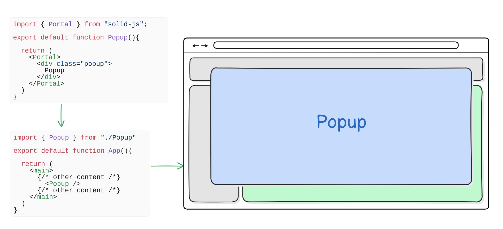

# 条件渲染

条件渲染是基于特定条件显示不同U元素的过程。这是UI开发中的常见模式，经常用于根据用户输入数据或其他条件显示或隐藏元素。

Solid 提供了专门的组件来更直接和可读地处理条件渲染。

## Show

`<Show>` 在某个条件被评估为真时，会渲染其子元素。与JavaScript中的三元运算符类似，它利用JSX内的控制逻辑流来确定要渲染的内容。

`<Show>`  有一个 `when` 属性，用于确定是否渲染其子元素。当状态或依赖的属性发生变化时，此属性将被重新评估。此属性可以是布尔值，或返回布尔值的函数。

```html
import { Show } from "solid-js"

<Show when={data.loading}>
  <div>Loading...</div>
</Show>
```

`<Show>` 具有fallback属性，可用于在条件评估为false时指定要渲染的内容。，该属性可以返回一个JSX元素。

```html
import { Show } from "solid-js"

<Show when={!data.loading} fallback={<div>Loading...</div>}>
  <h1>Hi, I am {data().name}.</h1>
</Show>
```

如果需要处理多种条件，`<Show>` 可以嵌套以处理每个条件。

```tsx
import { Show } from "solid-js"

<Show when={data.loading}>
  <div>Loading...</div>
  <Show when={data.error}>
    <div>Error: {data.error}</div>
  </Show>
</Show>
```

## Switch & Match

当需要处理多个条件时，使用嵌套 `<Show>` 组件来管理逻辑流程可能会变得困难。Solid 为此提供了`<Switch>`和 `<Match>` 组件。

与 JavaScript 的 switch/case 结构类似，`<Switch>` 将多个 `<Match>` 组件进行封装，使得每个条件按顺序进行评估。第一个评估结果为真的 `<Match>` 组件将显示其子元素，而其余的则会被忽略。

```html
import { Switch, Match } from "solid-js"

<Switch>
  <Match when={condition1}>
    <p>Outcome 1</p>
  </Match>
  <Match when={condition2}>
    <p>Outcome 2</p>
  </Match>
</Switch>
```

与 `<Show>` 类似，每个 `<Match>` 组件都有一个 `when` 属性，用于决定是否渲染其子组件。还可以向 `<Switch>` 传递一个可选的 `fallback` 属性，以指定当没有 `<Match>` 组件的判断结果为真时要渲染的内容。

```html
import { Switch, Match } from "solid-js"

<Switch fallback={<p>Fallback content</p>}>
  <Match when={condition1}>
    <p>Outcome 1</p>
  </Match>
  <Match when={condition2}>
    <p>Outcome 2</p>
  </Match>
</Switch>
```

# 动态组件

`<Dynamic>` 是一个 Solid 组件，它允许您根据数据动态渲染组件。通过将表示原生 HTML 元素的字符串或组件函数作为组件属性传递给该组件，您可以使用您提供的其余属性来渲染所选的组件。

```tsx
import { createSignal, For } from "solid-js";
import { Dynamic } from "solid-js/web";

const RedDiv = () => <div style="color: red">Red</div>;
const GreenDiv = () => <div style="color: green">Green</div>;
const BlueDiv = () => <div style="color: blue">Blue</div>;

const options = {
  red: RedDiv,
  green: GreenDiv,
  blue: BlueDiv,
};

export default function App() {
  const [selected, setSelected] = createSignal("red");
  return (
    <>
      <select value={selected()} onInput={(e) => setSelected(e.currentTarget.value)}>
        <For each={Object.keys(options)}>
          {(color) => <option value={color}>{color}</option>}
        </For>
      </select>
      <Dynamic component={options[selected()]} />
    </>
  );
}
```

此示例创建了一个 `<select>` 元素，用于供您从三种颜色中进行选择。一旦选择了某种颜色，`<Dynamic>` 组件就会渲染出与所选颜色相对应的组件或元素。

> **提示**：这个和 Vue 中的动态组件 `<component :is>` 有点类似。

`<Dynamic>` 所生成的代码比其他条件渲染选项更为简洁。例如，以下代码所呈现的结果与上一个示例完全相同：

```tsx
import { createSignal, Switch, Match, For } from "solid-js";

const RedDiv = () => <div style="color: red">Red</div>;
const GreenDiv = () => <div style="color: green">Green</div>;
const BlueDiv = () => <div style="color: blue">Blue</div>;

const options = {
  red: RedDiv,
  green: GreenDiv,
  blue: BlueDiv,
};
export default function App() {
  const [selected, setSelected] = createSignal("red");
  return (
    <>
      <select value={selected()} onInput={(e) => setSelected(e.currentTarget.value)}>
        <For each={Object.keys(options)}>
          {(color) => <option value={color}>{color}</option>}
        </For>
      </select>
      <Switch fallback={<BlueDiv />}>
        <Match when={selected() === "red"}>
          <RedDiv />
        </Match>
        <Match when={selected() === "green"}>
          <GreenDiv />
        </Match>
      </Switch>
    </>
  );
}
```

与其使用冗长的 `<Switch>` 和 `<Match>` 语句，`<Dynamic>` 提供了一种更简洁的方式来动态渲染组件。

## Props

在使用这些组件时，您可以将属性传递给正在渲染的组件，方法是将它们传递给 `<Dynamic>` 组件。这样，这些属性就能在您正在渲染的组件中可用，其方式类似于在 JSX 中向组件传递属性的方式。

```tsx
import { Dynamic } from "solid-js/web"

function App() {
  return (
    <Dynamic component={someComponent} someProp="someValue" />
  )
}
```

# 列表渲染

列表渲染功能允许您根据一组数据（例如数组或对象）生成多个元素，其中每个元素都对应于该数据集合中的一个项。

在处理动态数据时，Solid 提供了两种渲染列表的方式：`<For>` 组件和 `<Index>` 组件。这两个组件都能帮助您遍历数据集合以生成元素，但它们适用于不同的场景。

## \<For>

\<For> 是一个循环组件，它允许您根据数组或对象的内容来渲染元素。此组件旨在与复杂的数据结构（如对象数组）配合使用，因为这些列表的顺序和长度可能会频繁变化。

在 \<For> 中唯一的属性是 `each`，通过它您可以指定要循环处理的数据集合。此属性期望是一个数组，但也可以接受使用诸如 `Object.entries` 或 `Object.values` 等工具转换为数组的对象。

```html
import { For } from "solid-js"

<For each={data()}>
  {(item, index) =>
    // rendering logic for each element
  }
</For>
```

在 \<For> 标签之间，该组件需要一个回调函数，该函数将决定数据集合中的每个项目应如何进行渲染。这种结构类似于 JavaScript 的 map 方法中使用的回调函数，为遵循这种模式提供了熟悉的模式。

该函数接收两个参数：

- `item`：表示当前正在呈现的数据集合中的某一项目。
- `index`：当前项目在集合中的索引。

您可以访问当前项及其索引，从而动态设置 JSX 元素的属性或内容。索引是一个信号，必须作为函数调用才能获取其值。

```tsx
<For each={data()}>
  {(item, index) => (
    <li
      style={{
        color: index() % 2 === 0 ? "red" : "blue"
      }}
    >
      {item.name}
    </li>
  )}
</For>
```

## \<Index>

\<Index> 与 \<For>类似，是一种循环组件，可让您根据数组或对象中的内容来渲染元素。然而，如果列表的顺序和长度保持不变，但内容可能会频繁变化，那么 \<Index> 则是更好的选择，因为它会导致较少的重新渲染。

```html
import { Index } from "solid-js"

<Index each={data()}>
  {(item, index) => (
    // rendering logic for each element
  )}
</Index>
```

 与 \<For> 组件类似，\<Index> 也接受一个名为 each 的单一属性，您可以通过该属性传递您想要循环遍历的结构。

当索引是一个带有 \<For> 的信号时，它会保持不变，显示为 \<Index>。这是因为 \<Index> 更关注数组中元素的索引。因此，该项是一个信号，使得每个索引处的内容可以在不重新渲染的情况下发生变化，而索引保持不变。

```html
import { Index } from "solid-js"

<Index each={data()}>
  {(item, index) => (
    <li>
      {item().name} - {item().completed}
    </li>
  )}
</Index>
```

## \<Index> vs. \<For>

\<For> 设计用于在列表的顺序和长度可能频繁变化的情况下使用。当 \<For> 中的列表值发生变化时，整个列表会重新渲染。然而，如果数组发生改变，例如某个元素的位置发生变动，\<For> 会通过简单地移动相应的 DOM 节点并更新索引来处理这种情况。

\<Index> 的设计初衷是用于那些列表的顺序和长度保持不变，但内容会频繁变化的情况。在使用 \<Index>时，如果列表中的值发生变化，只会更新指定索引处的内容。

**何时适用 \<For> 🤔**

在不需要 signals、嵌套循环或动态列表的情况下，\<For> 是最佳选择。例如，在创建包含静态元素（如链接列表）的列表时，\<For> 是最合适的使用选项。这是因为它只会修改列表中元素的索引，而不会重新渲染整个列表。

```tsx
import { createSignal, For } from "solid-js"

function StringList() {
  const [items, setItems] = createSignal(["Item 1", "Item 2", "Item 3"])

  return (
    <ul>
      <input
        type="text"
        onInput={(e) => {
          // add the new item to the list
        }}
      />
      <For each={items()}>
        {(item, index) => (
          <li>
            {item} - {index()}
          </li>
        )}
      </For>
    </ul>
  )
}
```

如果你正在处理 signals、字符串、数字等 JavaScript 基本类型数据或者输入字段，那么使用 \<Index> 是更合适的选择。而如果你使用的是 \<For> ，那么每当值发生变化时，整个列表都会重新渲染，即便列表的长度保持不变也是如此。相比之下，\<Index> 只会更新指定索引处的内容，而列表的其余部分则保持不变。

```tsx
import { createSignal, Index } from "solid-js"

function FormList() {
  const [inputs, setInputs] = createSignal(['input1','input2','input3'])
  return(
    <form>
      <Index each={inputs()}>
        {(input, index) => (
          <input
            type="text"
            value={input()}
            onInput={(e) => {
              // update the input value
            }}
          />
        )}
      </Index>
    </form>
  )
}
```

# Portal

当某个元素需要在常规文档流之外进行渲染时，与堆叠内容和 z-index 相关的问题可能会干扰应用程序的预期意图或外观。\<Portal> 通过将元素放置在文档的其他位置来解决这一问题，从而使元素进入文档流，以便能够按预期进行渲染。

```html
import { Portal } from "solid-js/web"

<Portal>
  <div class="popup">...</div>
</Portal>
```

位于 \<Portal> 标签内的内容默认会在文档主体的末尾进行渲染和定位。



可以通过向 \<Portal> 传递一个 `mount` 属性来改变这一设置。该 `mount` 属性接受一个 DOM 节点，该节点将被用作门户内容的挂载点。

```html
import { Portal } from "solid-js/web"

<Portal mount={document.querySelector("main")}>
  <div class="popup">...</div>
</Portal>
```

使用 \<Portal>在某些情况下会特别有用，比如当诸如信息弹出框之类的元素可能会因父元素的溢出设置而被截断或遮挡时。通过将该元素置于父元素之外，它就不再受其父元素溢出设置的限制。这为用户创造了更友好的使用体验，因为内容不再被遮挡。

# 错误边界

默认情况下，如果应用程序的某个部分在渲染过程中出现错误，整个应用程序可能会崩溃，从而导致 Solid 将其用户界面从屏幕上移除。错误边界提供了一种捕获这些错误并防止整个应用程序崩溃的方法。

\<ErrorBoundary> 组件用于创建一个错误边界。它能够捕获在其子组件的渲染或更新过程中出现的任何错误。但需要注意的是，发生在渲染过程之外的情况，例如在事件处理程序中或在 setTimeout 之后发生的错误，并不会被错误边界捕获。

`fallback` 属性可用于在出现错误时显示用户友好的错误消息或通知。如果将一个函数传递给 `fallback`，它将接收错误对象以及一个重置函数。重置函数会促使 \<ErrorBoundary>重新渲染其子元素并重置错误状态，为用户提供从错误中恢复的方法。

```tsx
import { ErrorBoundary } from "solid-js";
import { Header, ErrorProne } from "./components";

export default function App() {
  return (
    <div>
      <Header />
      <ErrorBoundary
        fallback={(error, reset) => (
          <div>
            <p>Something went wrong: {error.message}</p>
            <button onClick={reset}>Try Again</button>
          </div>
        )}
      >
        <ErrorProne />
      </ErrorBoundary>
    </div>
  );
}
```

在该示例中，当 ErrorProne 组件抛出错误时，\<ErrorBoundary> 组件会捕获该错误，从而避免其影响应用程序的其他部分。相反，它会显示传递给 `fallback` 属性的错误消息。

