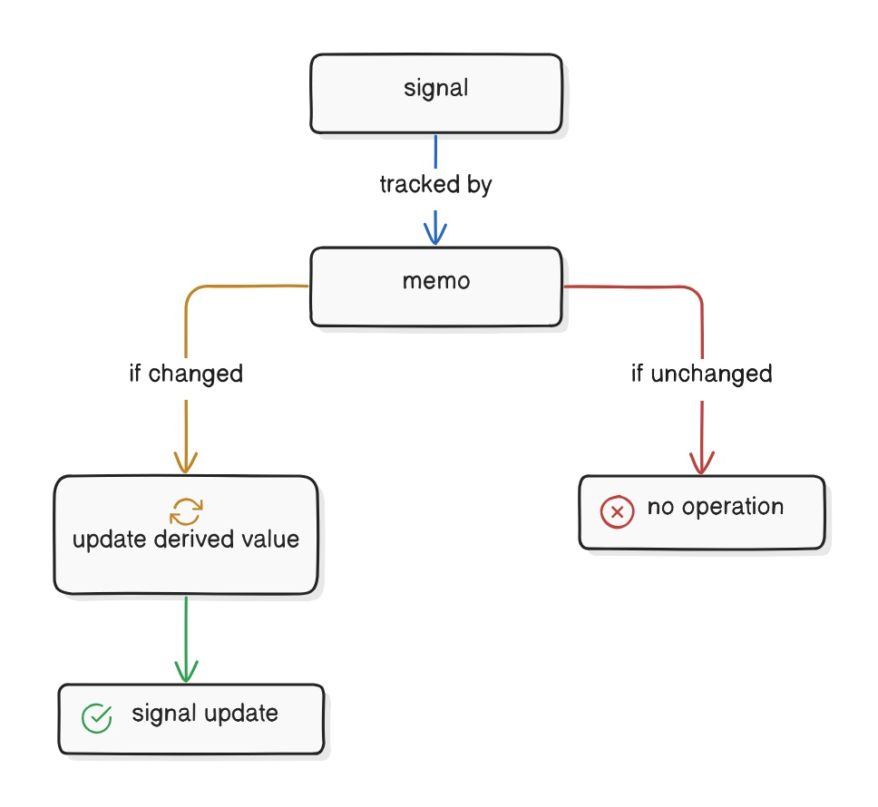

# 派生 Signals

派生信号是指那些依赖于一个或多个信号来得出数值的函数。

这些功能并非立即执行，而是只有在它们所依赖的值发生变化时才会被调用。当底层信号发生变化时，该函数会再次被调用以生成新的值。

```tsx
const double = () => count() * 2;
```

> **提示：**这个其实类似于 React 和 Vue 中的计算属性。

在上述示例中，double 函数依赖于 count 信号来生成一个值。当计数信号发生变化时，该 double 函数将再次被调用以生成新的值。

同样，您还可以创建一个依赖于存储值的派生信号，因为存储实际上是基于信号来运作的。

```tsx
const fullName = () => store.firstName + ' ' + store.lastName;
```

这些依赖函数会从它们所访问的信号中获取响应性，从而确保底层数据的变化能在整个应用程序中传播。需要特别注意的是，这些函数本身并不会存储值；相反，它们可以更新任何依赖于它们的 Effects 或组件。如果将这些衍生信号包含在组件的主体中，那么在必要时它们会触发更新。

虽然您可以采用这种方式创建派生值，但 Solid 也实现了 createMemo ，请看下文。

# Memos

Memos 是一种具有响应性的值类型，可用于对派生状态或耗时计算进行缓存。它们与派生信号类似，都是具有响应性的值，其依赖项发生变化时会自动重新计算。然而，与派生信号不同的是，Memos 经过优化，对于其依赖项的每次变化仅执行一次。

Memos 会暴露一个只读的响应式值（类似于信号），并跟踪其依赖项的变化（类似于 Effect）。这使得它们非常适合缓存昂贵或频繁访问的计算结果。通过这样做，Memos 能够在应用程序中减少不必要的工作，因为它们会保留计算的结果，直到其依赖项发生变化。

## 使用 Memos

使用 createMemo 函数可以创建一个记忆化函数。在该函数内部，您可以定义希望进行记忆化的衍生值或计算操作。当调用 createMemo 时，它会返回一个获取函数，该函数会读取记忆化的当前值：

```tsx
import { createMemo, createSignal } from "solid-js"

const [count, setCount] = createSignal(0)

const isEven = createMemo(() => count() % 2 === 0)

console.log(isEven()) // true

setCount(3)
console.log(isEven()) // false
```

Memos 与 Effects 看起来相似，但它们之间存在区别，即 Memos 会返回一个值。这个值是您希望进行 memoize 处理的计算结果或衍生状态。

**使用 Memos 的优势**

虽然您也可以利用衍生信号来达到类似的效果，但 Memos具有独特的优势：

1. Memos 经过优化，每次依赖项发生变化时仅执行一次。
2. 在处理耗时计算时，可以使用 Memos 来缓存结果，以避免不必要的重新计算。
3. Memos 仅在其依赖项发生变化时才重新计算，并且如果依赖项发生变化但其值保持不变，则不会触发后续更新（通过 === 或严格相等性判断）。
4. 在 Memos 的函数内部访问的任何信号或 Memos 都会被跟踪。这意味着当这些依赖项发生变化时，Memos 会自动重新评估。



# Memos vs. Effect

在处理响应式计算和副作用时，Memos 和 effect 都是至关重要的。不过，它们的作用不同，各自也有着独特的特性。

|          | Memos                                                | Effect                                        |
| -------- | ---------------------------------------------------- | --------------------------------------------- |
| 返回值   | Yes - 是-返回计算结果或派生状态的获取器。            | No - 不返回值，但响应更改时执行代码块。       |
| 缓存结果 | Yes                                                  | No                                            |
| 行为     | 函数参数应为纯函数，无响应式副作用。                 | 函数参数可能会导致副作用，如U更新或数据获取。 |
| 依赖追踪 | Yes                                                  | No                                            |
| 使用示例 | 转换数据结构、计算聚合值、派生状态或其他昂贵的计算。 | UI更新、网络请求或外部集成。                  |

# 最佳实践

## 纯函数

在处理 Memos 时，建议您保持其“原样”不作任何改动。

```tsx
import { createSignal, createMemo } from "solid-js"

const [count, setCount] = createSignal(0)
const isEven = createMemo(() => count() % 2 === 0) // example of a pure function
```

纯函数是指不会产生任何副作用的函数。这意味着该函数的输出应完全取决于其输入。

当您在 Memos 添加副作用时，可能会使反应链变得复杂。这可能会导致意想不到的情况，比如无限循环，从而导致您的应用程序崩溃。

```tsx
import { createSignal, createMemo } from "solid-js"

const [count, setCount] = createSignal(0)
const [message, setMessage] = createSignal("")

const badMemo = createMemo(() => {
  if (count() > 10) {
    setMessage("Count is too high!") //  side effect
  }
  return count() % 2 === 0
})
```

当一个 Memos 存在会导致其依赖项发生变化的副作用时，就会触发这些无限循环。这会导致该 Memos 重新进行评估，然后又会触发该副作用，如此循环往复，直至应用程序崩溃。

可以通过使用 createEffect 来处理副作用来避免这种情况：

```tsx
mport { createSignal, createMemo, createEffect } from "solid-js"

const [count, setCount] = createSignal(0)
const [message, setMessage] = createSignal("")

const isEven = createMemo(() => count() % 2 === 0)

createEffect(() => {
  if (count() > 10) {
    setMessage("Count is too high!")
  }
})
```

在这里，createEffect 将负责处理副作用，而 isEven 的记忆化操作则会保持纯函数特性。

## 在 Memos 中保持逻辑清晰

Memos 的设计旨在针对每次依赖关系的变化仅执行一次。这意味着您可以移除由 Memos 的依赖关系所触发的不必要的效果。

在处理衍生状态时，建议采用 Memos 而非 Effect 的方式来实现。将逻辑置于 Memos 中可以避免在使用 Effect 时可能出现的不必要的重新渲染。同样，Effect 更适合处理副作用（如 DOM 更新）等事项，而非衍生状态。这种关注点的分离有助于保持代码的整洁和易于理解。

```tsx
/ effect - runs whenever `count` changes
createEffect(() => {
  if (count() > 10) {
    setMessage("Count is too high!")
  } else {
    setMessage("")
  }
})

// memo - only runs when `count` changes to or from a value greater than 10
const message = createMemo(() => {
  if (count() > 10) {
    return "Count is too high!"
  } else {
    return ""
  }
})
```

