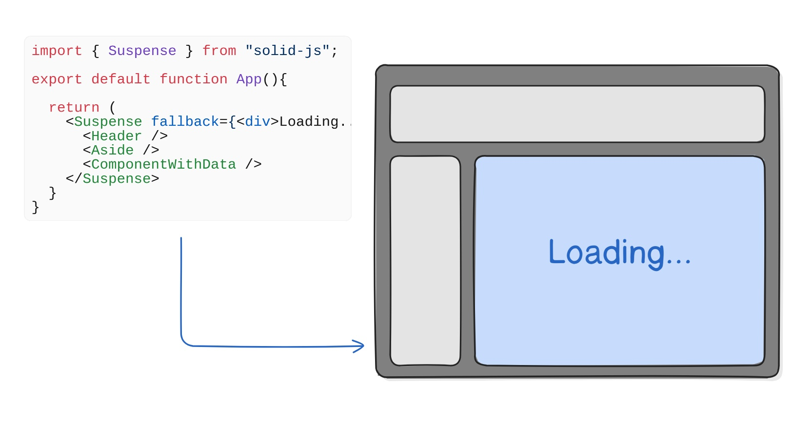

@See https://docs.solidjs.com/guides/fetching-data

# 概述

对于大多数现代 Web 应用而言，数据获取是一项常见任务。Solid 内置了 `createResource` 工具函数，专门用于简化数据获取流程。

# 什么是 `createResource`  

`createResource` 是一种专为管理异步数据获取而设计的特殊 Signal。它封装了异步操作，提供了处理多种状态的能力：加载中、成功和错误。

该函数采用非阻塞设计，这意味着即使在获取数据过程中，`createResource` 也能保证应用程序保持响应状态。因此可以避免传统异步处理中的常见问题，例如数据获取期间界面无响应的情况。

# 使用 `createResource`

`createResource` 需要接收一个返回 Promise 的函数作为参数。调用时，它会返回一个具有响应式属性的 Signal，包括 `loading`、`error`、`latest`等。这些属性可用于根据当前响应状态条件渲染JSX。

创建的 fetcher 函数会调用获取用户数据，该函数随后作为参数传递给 `createResource`。

`createResource` 返回的信号提供以下属性，可帮助基于当前响应状态进行条件渲染：

- `state`：操作当前状态（未开始 `unresolved`、进行中 `pending`、已完成 `ready`、刷新中 `refreshing` 或错误 `errored`）
- `loading`：布尔值，指示操作是否正在进行
- `error`：若操作失败，该属性将包含错误信息（可能是错误消息字符串或包含详细信息的对象）
- `latest`：操作返回的最新数据结果

当源信号发生变化时，会触发内部获取流程以基于该变化获取新数据。

```tsx
import { createSignal, createResource, Switch, Match, Show } from "solid-js";

const fetchUser = async (id) => {
  const response = await fetch(`https://swapi.dev/api/people/${id}/`);
  return response.json();
};

export default function App() {
  const [userId, setUserId] = createSignal();
  const [user] = createResource(userId, fetchUser);

  return (
    <div>
      <input type="number" min="1" placeholder="Enter Numeric Id" onInput={(e) => setUserId(e.currentTarget.value)} />
      <Show when={user.loading}>
        <p>Loading...</p>
      </Show>
      <Switch>
        <Match when={user.error}>
          <span>Error: {user.error}</span>
        </Match>
        <Match when={user()}>
          <div>{JSON.stringify(user())}</div>
        </Match>
      </Switch>
    </div>
  );
}
```

当信号值 `userId` 发生变化时，会触发内部获取方法 `fetchUser`。`user` 资源的属性允许根据获取过程的不同状态进行条件渲染。

`<Switch>/<Match>` 结构提供了管理这些条件的一种方式。当获取成功并检索到用户数据时，`user()` 条件变为活动状态，执行其相关代码块。然而，如果获取过程中出现错误，`user.error` 块会变为 true，从而显示其对应的 `<Match>` 块。

> 注意：SolidJS 的 `<Switch>`组件会在其子 `<Match>`组件中渲染第一个条件为 true 的匹配项，类似于 JavaScript 的 switch 语句

> 提示：若需处理潜在错误，建议将 `createResource`包裹在 `ErrorBoundary`中。

除 `error`属性外，`loading`属性可在数据获取期间向用户展示加载状态。

# 调用多个异步事件

虽然您可以独立使用 `createResource`，但 Solid 提供了另一种方法来同步显示多个异步事件。`Suspense`是 Solid 中的一个组件，专门用作边界。它允许您在等待所有异步事件完成时显示备用占位内容，从而避免显示部分加载的内容。

```tsx
import { createSignal, createResource, Switch, Match, Suspense } from "solid-js";

const fetchUser = async (id) => {
  const response = await fetch(`https://swapi.dev/api/people/${id}/`);
  return response.json();
};

export default function App() {
  const [userId, setUserId] = createSignal();
  const [user] = createResource(userId, fetchUser);

  return (
    <div>
      <input type="number" min="1" placeholder="Enter Numeric Id" onInput={(e) => setUserId(e.currentTarget.value)} />
      <br />
      <Suspense fallback={<div>Loading...</div>}>
        <Switch>
          <Match when={user.error}>
            <span>Error: {user.error.message}</span>
          </Match>
          <Match when={user()}>
            <div>{JSON.stringify(user())}</div>
          </Match>
        </Switch>
      </Suspense>
    </div>
  );
```

`Suspense` 能够识别其后代组件中的异步读取操作并做出相应处理。该特性有助于消除在部分加载状态下可能显示的中间组件。此外，您可以在 `Suspense`中嵌套任意数量的组件，但当检测到加载状态时，只有最接近的祖先组件会切换至备用状态。

> 注：这种机制确保了加载状态的最小化影响范围，同时保持组件树的灵活性



# 动态数据处理

通过 `createResource`的第二个输出参数，提供了两个增强数据管理能力的方法：

## mutate

当需要即时反馈时，`mutate `方法支持"乐观更新"。这些更新会立即生效，即使后台服务（如服务器确认）仍在进行中。

此功能在任务列表等场景特别实用。例如当用户添加新任务时，列表会立即刷新，无需等待服务器响应：

```tsx
import { For, createResource } from "solid-js"

function TodoList() {
  const [tasks, { mutate }] = createResource(fetchTasksFromServer);

  return (
    <>
      <ul>
        <For each={tasks()}>
          {(task) => (
            <li>{task.name}</li>
          )}
        </For>
      </ul>
      <button
        onClick={() => {
          mutate((todos) => [...todos, "do new task"]); // 立即更新本地数据
          // 异步发送到数据库
        }}
      >
        添加任务
      </button>
    </>
  );
}
```

## refetch

当需要实时数据时，`refetch` 可以强制重新查询，不受任何变更限制。该方法特别适合金融行情等持续变化的数据：

```tsx
import { createResource, onCleanup } from "solid-js"

function StockPriceTicker() {
  const [prices, { refetch }] = createResource(fetchStockPrices);

  const timer = setInterval(() => {
    refetch() // 每秒刷新数据
  }, 1000);
  onCleanup(() => clearInterval(timer))
}
```


